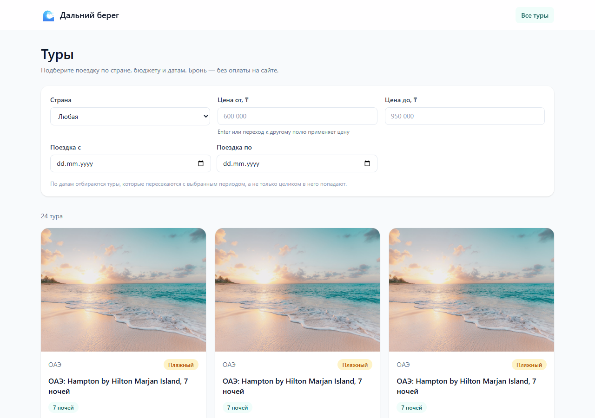
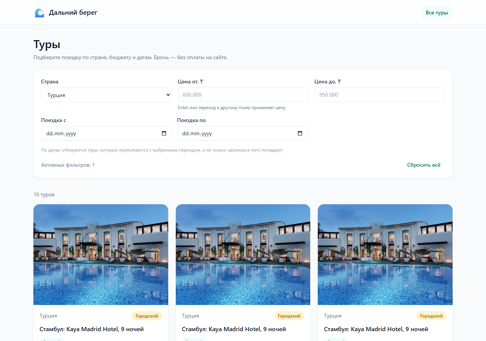
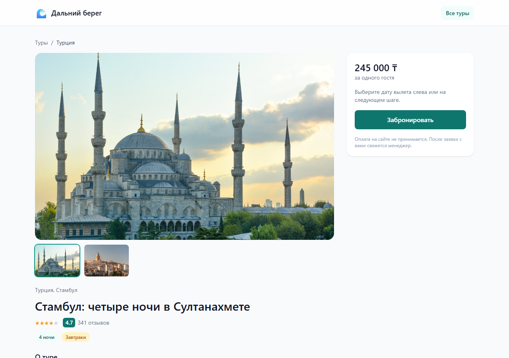
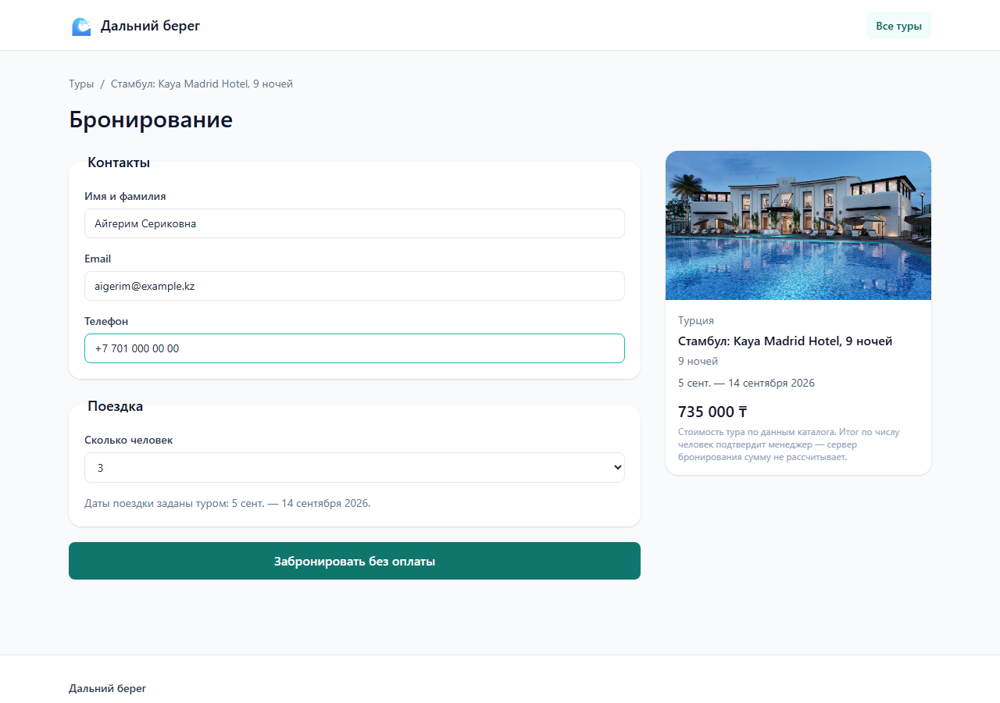

# Дальний берег — фронтенд платформы бронирования туров

Подбор и бронирование туров: каталог, фильтры по стране, цене и датам вылета, страница тура, оформление брони без оплаты на сайте.

Сайт полностью работоспособен **без backend и без AI**: слой данных подставляет мок-каталог, брони живут в `localStorage`. Переключение на реальный сервер — правка `.env`, а не кода.



---

## Быстрый старт

```bash
npm install
```

```bash
npm run dev
```

Приложение откроется на `http://localhost:5173` (порт можно переопределить переменной `PORT`). Ничего дополнительно поднимать не нужно — данные берутся из `src/mocks/tours.json`.

## Команды

| Команда | Что делает |
|---|---|
| `npm run dev` | Dev-сервер с горячей перезагрузкой |
| `npm run build` | Проверка типов и прод-сборка в `dist/` |
| `npm run preview` | Прод-сборка локально на `:4173` |
| `npm run typecheck` | `tsc --noEmit` |
| `npm run lint` | ESLint |
| `npm test` | Юнит- и компонентные тесты |
| `npm run test:coverage` | То же с отчётом покрытия |
| `npm run test:e2e` | Сквозные сценарии Playwright |

## Возможности

**Каталог** — фильтры по стране, диапазону цены, окну дат вылета и числу гостей; сортировка по цене, рейтингу и ближайшему вылету; подгрузка по страницам.

**Фильтры хранятся в строке запроса.** Отфильтрованная выдача открывается по прямой ссылке, переживает перезагрузку и корректно отрабатывает кнопку «назад».

**Страница тура** — галерея, категория отеля, тип питания, состав пакета, выбор конкретного вылета с учётом свободных мест.

**Бронирование** — форма с валидацией и живым пересчётом суммы; групповая скидка от трёх гостей; экран подтверждения с номером брони.

**Оплаты нет ни на одном шаге** — это продуктовое требование, а не незавершённость. Бронь создаётся со статусом «ожидает подтверждения менеджера».

| Фильтры | Страница тура | Бронирование |
|---|---|---|
|  |  |  |

Мобильные версии тех же экранов — в `docs/screenshots/*-mobile.png`.

---

## Как переключить на реальный backend

Всё приложение обращается к данным через единственный интерфейс `Api` из `src/api`. Какая реализация за ним стоит, решает одна переменная окружения. Компоненты и хуки при переключении **не меняются**.

Скопируйте `.env.example` в `.env.local` и укажите:

```
VITE_API_MODE=http
VITE_API_BASE_URL=https://api.example.kz
```

Контракт эндпоинтов, которые должен реализовать сервер:

| Метод | Путь | Параметры | Ответ |
|---|---|---|---|
| `GET` | `/tours` | `country`, `priceMin`, `priceMax`, `dateFrom`, `dateTo`, `guests`, `sort`, `page`, `limit` | `200` `Paginated<Tour>` |
| `GET` | `/tours/:id` | — | `200` `Tour` · `404` |
| `GET` | `/countries` | — | `200` `string[]` |
| `POST` | `/bookings` | `BookingDraft` | `201` `Booking` · `400` |
| `GET` | `/bookings/:id` | — | `200` `Booking` · `404` |

Полное описание форматов — в [`ai-rules/frontend.md`](ai-rules/frontend.md) → **Output Contracts**.

**Что страхует переключение.** `src/api/__tests__/contract.test.ts` — один набор из 17 проверок, который прогоняется по обоим адаптерам сразу: мок и HTTP (второй обслуживается MSW). Если реализации разойдутся в поведении — например, сервер вернёт `null` вместо `404` или перестанет списывать занятые места — тест упадёт до того, как это увидит пользователь.

## Архитектура

```
src/
├── api/              слой данных: контракт + два адаптера
│   ├── contract.ts     интерфейс Api, типы запросов, ApiError
│   ├── index.ts        выбор адаптера по VITE_API_MODE — единственная точка
│   ├── schemas.ts      zod-схемы: валидируют и мок, и ответы сервера
│   ├── filterTours.ts  фильтрация и сортировка каталога (чистая функция)
│   └── adapters/       mock.ts (tours.json + localStorage), http.ts (fetch)
├── domain/           бизнес-правила чистыми функциями: цены, доступность вылетов
├── hooks/            react-query поверх api + фильтры в URL
├── components/       ui/ — примитивы, tours/ и booking/ — предметные
├── pages/            пять экранов приложения
├── lib/format.ts     деньги и даты: ru-KZ, тенге
└── mocks/tours.json  18 туров, 7 стран
```

Правила, по которым это устроено, вынесены в [`ai-rules/frontend.md`](ai-rules/frontend.md) и частично проверяются автоматически: ESLint запрещает прямой `fetch` вне адаптеров и импорт конкретного адаптера из компонентов.

Как велась работа с AI, какие MCP и сабагенты применялись и что они дали — в [`WORKFLOW.md`](WORKFLOW.md).

## Тесты

```bash
npm run test:coverage
```

136 юнит- и компонентных тестов. Покрытие слоёв `api`, `domain`, `hooks`, `lib` — 96% строк при пороге 80%.

```bash
npm run test:e2e
```

14 сквозных сценариев на десктопной и мобильной ширине против прод-сборки: путь «нашёл тур → выбрал вылет → забронировал → получил номер брони» целиком, плюс поведение фильтров в URL.

Playwright при первом запуске требует браузер:

```bash
npx playwright install chromium
```

## Стек

Vite · React 19 · TypeScript (strict) · Tailwind CSS 4 · react-router · TanStack Query · react-hook-form + zod · Vitest + Testing Library · MSW · Playwright.

UI-кит не используется: примитивы в `src/components/ui` написаны под проект.

## Ограничения

- **Изображения каталога** — ссылки на Unsplash. Все проверены на доступность и на соответствие направлению; часть фото повторяется в двух турах. Это мок-данные, при подключении реального backend они уйдут.
- **AI-чат-бот** не реализован в этой итерации сознательно: продуктовое требование — сайт обязан работать без AI. Слой `src/api` готов служить площадкой для его инструментов: `listTours` уже принимает бюджет, даты и число гостей.
- **Аутентификации нет** — бронь оформляется без входа, как заявка.
