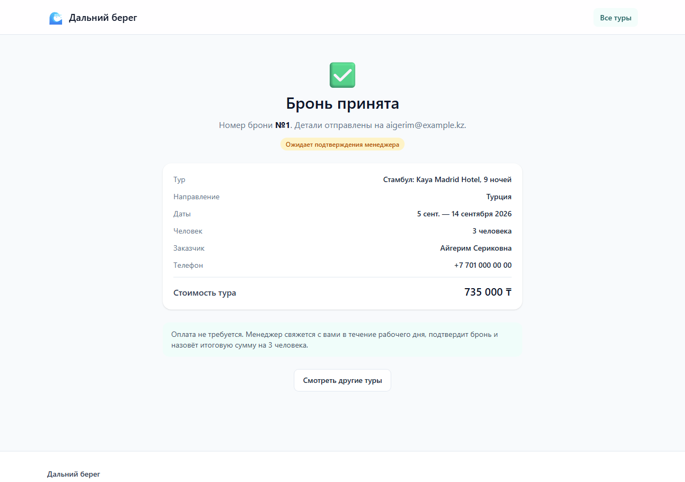

# Дальний берег — платформа подбора и бронирования туров

Подбор и бронирование туров: каталог, фильтры по стране, цене и датам, страница тура, оформление заявки без оплаты на сайте.

Этот README описывает **фронтенд**. Бэкенд — в [`backend/README.md`](backend/README.md), сквозные QA-сценарии — в `tests/`, условия задания — в [`requirement.md`](requirement.md).


---

## Структура репозитория

```
frontend/        фронтенд-приложение: код, тесты, конфигурация сборки
backend/         API на Go + Echo + PostgreSQL
tests/           сквозные QA-сценарии на Playwright
ai-rules/        спецификации ролей для AI, по одной на участника
docs/            скриншоты и проектные спеки, включая контракт API
requirement.md   условия задания
```

## Быстрый старт

Фронтенд работает поверх реального API — сначала поднимите бэкенд по инструкции в [`backend/README.md`](backend/README.md), он слушает `:8080`.

Дальше все команды выполняются из папки `frontend/`:

```bash
cd frontend
```

```bash
npm install
```

```bash
npm run dev
```

Приложение откроется на `http://localhost:5173` (порт можно переопределить переменной `PORT`). Адрес бэкенда задаётся в `frontend/.env.development`.

Если бэкенда под рукой нет, посмотреть интерфейс можно на сборке для e2e — в ней API подменён заглушкой в браузере:

```bash
npm run build:e2e && npm run preview
```

## Команды

| Команда | Что делает |
|---|---|
| `npm run dev` | Dev-сервер с горячей перезагрузкой |
| `npm run build` | Проверка типов и прод-сборка в `dist/` |
| `npm run build:e2e` | Сборка с браузерной заглушкой API (для e2e и демо без бэкенда) |
| `npm run preview` | Прод-сборка локально на `:4173` |
| `npm run typecheck` | `tsc --noEmit` |
| `npm run lint` | ESLint |
| `npm test` | Юнит- и компонентные тесты |
| `npm run test:coverage` | То же с отчётом покрытия |
| `npm run test:e2e` | Сквозные сценарии Playwright |

## Возможности

**Каталог** — фильтры по стране, диапазону цены и датам поездки; подгрузка по страницам. По датам отбираются туры, диапазон которых пересекается с выбранным периодом, а не только целиком в него попадает — так это работает и на бэкенде.

**Фильтры хранятся в строке запроса.** Отфильтрованная выдача открывается по прямой ссылке, переживает перезагрузку и корректно отрабатывает кнопку «назад».

**Страница тура** — фото, категория, описание, даты и длительность поездки, стоимость.

**Бронирование** — форма с валидацией по правилам API и экран подтверждения с номером заявки.

**Оплаты нет ни на одном шаге** — это продуктовое требование, а не незавершённость. Заявка создаётся со статусом `pending`; итоговую сумму по числу человек называет менеджер, сервер её не рассчитывает.

| Фильтры | Страница тура | Бронирование | Подтверждение |
|---|---|---|---|
|  |  |  |  |

Мобильные версии тех же экранов — в `docs/screenshots/*-mobile.png`.

---

## Как фронтенд говорит с бэкендом

Всё приложение обращается к данным через единственный интерфейс `Api` из `frontend/src/api`. Реализация одна — HTTP-клиент; компоненты о ней не знают и обращений к сети не содержат, это проверяет ESLint.

Адрес сервера — в `frontend/.env.development`, префикс `/api/v1` добавляет клиент:

```
VITE_API_BASE_URL=http://localhost:8080
```

Полный контракт — [`docs/superpowers/specs/api.md`](docs/superpowers/specs/api.md). Что важно знать про клиент:

| Метод | Путь | Параметры | Ответ |
|---|---|---|---|
| `GET` | `/tours` | `country_id`, `min_price`, `max_price`, `date_from`, `date_to`, `page`, `limit` | `200` `Paginated<Tour>` · `422` |
| `GET` | `/tours/:id` | — | `200` `Tour` · `404` |
| `GET` | `/countries` | — | `200` `Country[]` |
| `POST` | `/bookings` | `CreateBookingRequest` | `201` `Booking` · `404` · `422` |
| `GET` | `/bookings/:id` | — | `200` `Booking` · `404` |

**Граница snake_case.** API говорит в snake_case, приложение — в camelCase. Перевод и проверка формы делаются zod-схемами в `frontend/src/api/schemas.ts`; дальше этого файла `country_id` и `num_people` не проходят. Если бэкенд отступит от контракта, это обнаружится на границе слоя данных, а не в середине рендера.

**Что страхует совместимость.** `frontend/src/api/__tests__/contract.test.ts` — 19 проверок клиента против заглушки, повторяющей спецификацию: пагинация, пересечение дат, коды 404 и 422, snake_case в теле запроса. Расхождение валит сборку.

## Архитектура

```
frontend/src/
├── api/                  слой данных
│   ├── contract.ts         интерфейс Api, типы запросов, ApiError
│   ├── index.ts            единственная точка входа для приложения
│   ├── schemas.ts          zod: проверка ответа и перевод в camelCase
│   └── adapters/http.ts    клиент реального API
├── hooks/                react-query поверх api + фильтры в URL
├── components/           ui/ — примитивы, tours/ — предметные
├── pages/                пять экранов приложения
├── lib/format.ts         деньги и даты: ru-KZ, валюта из тура
└── test/                 фикстуры и заглушка бэкенда для тестов
```

Правила, по которым это устроено, вынесены в [`ai-rules/frontend.md`](ai-rules/frontend.md) и частично проверяются автоматически: ESLint запрещает прямой `fetch` вне адаптера и импорт адаптера из компонентов.

Как велась работа с AI — в [`WORKFLOW.md`](WORKFLOW.md).

## Тесты

```bash
npm run test:coverage
```

82 юнит- и компонентных теста. Покрытие слоёв `api`, `hooks`, `lib` — 97% строк при пороге 80%. Сети в тестах нет: запросы перехватывает MSW, а заглушка в `src/test/handlers.ts` реализует контракт API.

```bash
npm run test:e2e
```

14 сквозных сценариев на десктопной и мобильной ширине против прод-сборки: путь «нашёл тур → открыл → забронировал → получил номер заявки» целиком, плюс поведение фильтров в URL. Бэкенд для них не нужен — в сборке `build:e2e` его подменяет service worker.

Playwright при первом запуске требует браузер:

```bash
npx playwright install chromium
```

## Стек

Vite · React 19 · TypeScript (strict) · Tailwind CSS 4 · react-router · TanStack Query · react-hook-form + zod · Vitest + Testing Library · MSW · Playwright.

UI-кит не используется: примитивы в `src/components/ui` написаны под проект.

## Ограничения

Все они следуют из контракта API, а не из незаконченности фронтенда:

- **Сортировки нет** — `GET /tours` её не поддерживает. Сортировать на клиенте поверх подгруженных страниц значило бы упорядочивать не весь каталог, а случайный его кусок.
- **Фильтра по числу человек нет** — бэкенд не хранит места и не проверяет доступность.
- **Один отель — несколько туров.** В модели API тур это отель плюс конкретные даты, поэтому в каталоге один отель встречается несколько раз с разными датами и ценой. Так отдаёт сервер, и так же работает пагинация.
- **Ни рейтингов, ни звёзд, ни питания, ни галереи** — этих полей в API нет. Часть значений упоминается в тексте описания, но вытаскивать их разбором строки ненадёжно.
- **Итоговая сумма брони не показывается.** Сервер её не возвращает, а `price` не помечен как «за человека» — умножать самим значило бы назвать клиенту цифру, о которой оператор не знает.
- **AI-чат-бот** не реализован сознательно: сайт обязан работать без AI. Слой `src/api` готов служить площадкой для его инструментов.
- **Аутентификации нет** — бронь оформляется без входа, как заявка; это заложено в дизайне API.
